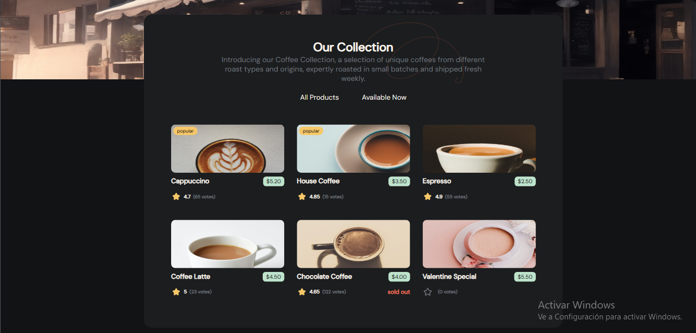
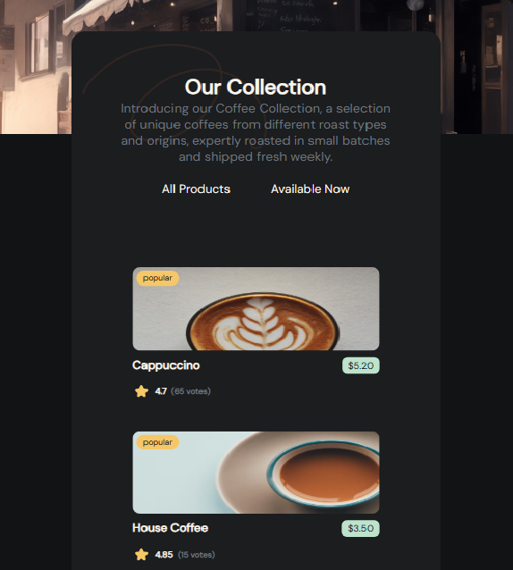
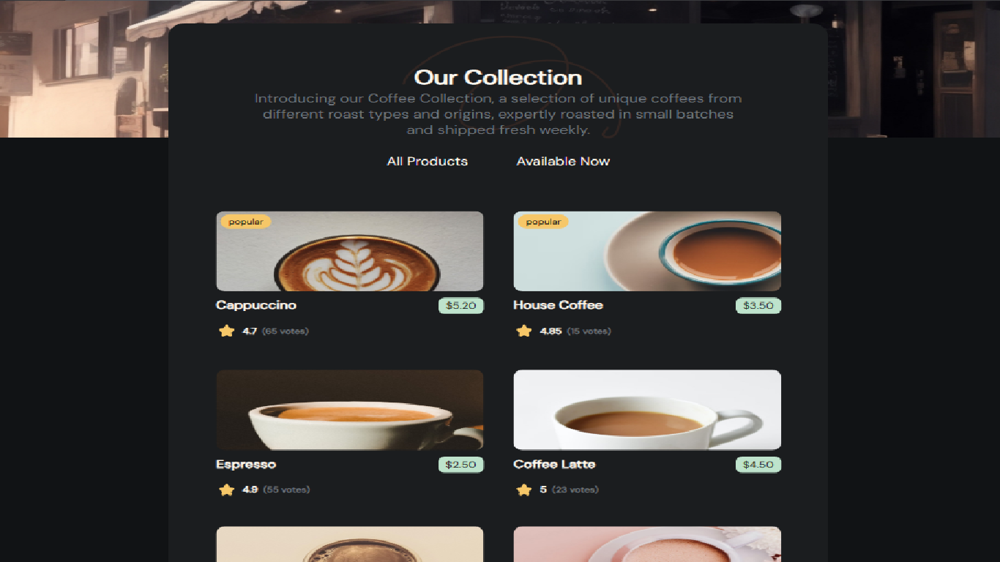

<div align='center'>
 <h1><em>💻 Project Coffee 🚀</em></h1>
  
 <p>  </p>
 <p>  </p>
<p align='justify'>
 This project is a deployment of a list of coffees, available and unavailable, in this case we consume an API provided by the client to show the types of coffees of the business, this project is a challenge of <a href="https://devchallenges.io/dashboard" target="_blank">devChallenge</a> which generates a large number of projects to carry out.
</p>

</div>

## Built With
For these project, the following tools, frameworks/libraries and development environments (IDEs) were used:
- 
- 
- 
- 
- 
- 
- 
- 

## Responsive Design (mobile & tablet)
These are the project's designs optimized for both mobile and tablet viewing, complying with different screen resolutions and maintaining a consistent user experience across different screen sizes.
<div align="center">
  
   
</div>

## Getting Started
### Prerequisites 
> You must meet certain requirements, you must first have a `node.js`.
>> Install `npm`. 
  ```sh
   npm install npm@latest -g
   ```
>> Install `vite`.
  ```sh
   npm install -g vite
   ```
### Installation
> To deploy your application on-premises, you must follow the steps below.
>> Clone the repo
  ```sh
   git clone https://github.com/juanRCode/Project-Coffee.git
   ```
>> Install NPM packages
  ```sh
   npm install
   ```
>> View the app
  ```sh
  // mode development
   npm run dev
  // final mode
   npm run start
   ```

## Resources Provided
The resources provided by the client were as follows:
#### Files SVG:
1. Start-fill: [Start-fill.svg](./src/assets/Start-fill.svg)
2. Start: [Start.svg](./src/assets/Start.svg)
3. vector: [vector.svg](./src/assets/vector.svg)
#### APIS:
API Coffee
  ```sh
   https://raw.githubusercontent.com/devchallenges-io/web-project-ideas/main/front-end-projects/data/simple-coffee-listing-data.json
   ```

API Data
  ```sh
   https://github.com/devchallenges-io/web-project-ideas/blob/main/front-end-projects/simple-coffee-listing.json
   ```

## Contact
juanRCoder - (Instagram)[[@juanrcoder](https://www.instagram.com/juanrcoder/)] -  (Linkedin)[[@juan Ramirez](https://www.linkedin.com/in/juan-ramirez-490b84271/)]

Project Link: [https://juanrcoder.github.io/Project-Coffee/](https://juanrcoder.github.io/Project-Coffee/)


